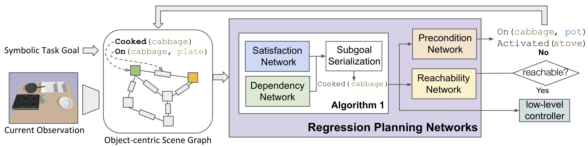
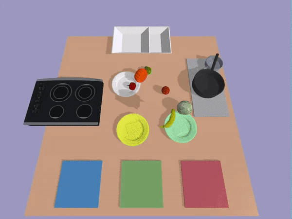

# Regression Planning Networks



A reference implementation of the [Regression Planning Networks](https://arxiv.org/abs/1909.13072). 

This repo also includes the simulated environments
used in the paper: GridWorld and Kitchen3D. GridWorld is built on [gym-minigrid](https://github.com/maximecb/gym-minigrid).
Kitchen3D is simulated with [PyBullet](https://github.com/bulletphysics/bullet3/tree/master/examples/pybullet). Most of the PyBullet utilities are adapted from Caelan Garrett's 
[ss-pybullet](https://github.com/caelan/ss-pybullet). The [Appendix](assets/RPN_Appendix.pdf) of the original paper is also included here for reference.

To cite the code, use bibtex:
```
@inproceedings{xu2019rpn,
  title={Regression Planning Networks},
  author={Xu, Danfei and Martín-Martín, Roberto and Huang, De-An and Zhu, Yuke and Savarese, Silvio and Fei-Fei, Li},
  booktitle={Thirty-third Conference on Neural Information Processing Systems (NeurIPS)},
  year={2019}
 }
```



## Installation and Setup
Requirement: Python >= 3.6

Note: The code DOES NOT work with Python 3.5

```
$ git clone https://github.com/danfeiX/rpn.git
$ git submodule update --init --recursive
$ pip install -r requirements.txt
$ cd rpn
$ mkdir checkpoints
$ mkdir data
```

## Kitchen3D

### Dataset
To reproduce the main experiments, first create a demonstration dataset with three ingredients and two dishes 
(`I=3`, `D=2`). 
```
$ python create_dataset_pb.py --problem pb_cook_meal_3i_2d_3m_iter \
    --dataset data/pb_cook_3i_2d_3m_10_s0.group \
    --num_episodes 10 --num_tasks -1 --seed 0 \
    --teleport --num_chunks 100 --num_workers 10
```
The entire process takes around 3 hours with 10 works (`--num_workers 10`) on a machine with i7-7700K CPU @ 4.20GHz.
 The dataset will be written to `data/pb_cook_3i_2d_3m_10_s0.group`. 
 
To create a smaller validation set, run:
```
$ python create_dataset_pb.py --problem pb_cook_meal_3i_2d_3m_iter \
    --dataset data/pb_cook_3i_2d_3m_1_s1.group \
    --num_episodes 1 --num_tasks -1 --seed 1 \
    --teleport --num_chunks 10 --num_workers 10
```
 
### Train
To train our full RPN model, run:
```
$ python train.py --dataset data/pb_cook_3i_2d_3m_10_s0.group \
    --testset data/pb_cook_3i_2d_3m_1_s1.group \
    --exp rpn \
    --run experiment \
    --batch_size 128 \
    --eval_batch_size 128 \
    --eval_freq 1 --save_freq 1 \
    --num_epoch 10 --config configs/pbv_rpn.json \
    --num_workers 1
```

Checkpoints will be written to `checkpoints/rpn/experiment/` each epoch. Both text and tensorboard event will be written
to `checkpoints/rpn/experiment/log/`.

#### Evaluation
To evaluate a trained model on the Kitchen3D task with `I=6` and `D=3`, run:

```
$ python eval_pb.py --restore_path checkpoints/rpn/experiment/ckpt_ep6.pt \
       --problem pb_cook_meal_6i_3d_6m_shuffle \
       --num_eval 1000 --seed 1 \
       --display
```

Aside: Our naming convention for the cooking tasks is `pb_cook_meal_<I>i_<D>d_<M>m_<shuffle/iter>`, where `<I>` is the 
number of ingredients involved, `<D>` is the number of dishes to cook, `<M>` is the maximum number of ingredients that
can be placed on a plate (usually set to be equal to `<I>`), and `<shuffle/iter>` is whether to shuffle the list of 
all possible tasks under the current task specification. 
